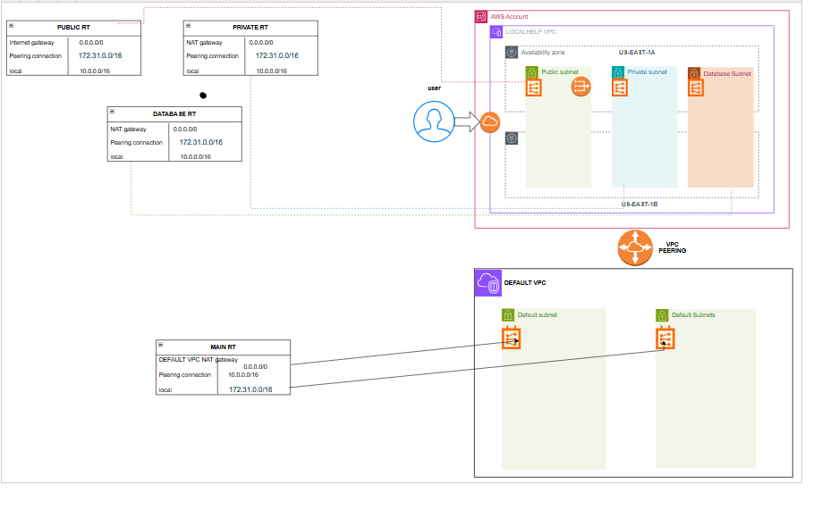

# Custom AWS VPC Module

This module is created for my own organization, It creates resources in first two availability zones for High Availability.

I am creating the following resources:

* VPC
* Internet Gateway
* VPC & Internet Gateway attachment
* 2 Public Subnets
* 2 Private Subnets
* 2 Database Subnets
* ELASTIC IP
* NAT Gateway
* Public Route Table
* Private Route Table
* Database Route Table
* Route table associations with subnets
* Routes in all the route tables
* VPC Peering required for user
* Routes of peering in requestor and acceptor VPC
* Database subnet groups

# Inputs:
 updation required (refer variables.tf)

# Outputs:
 updation required (refer outputs.tf)
